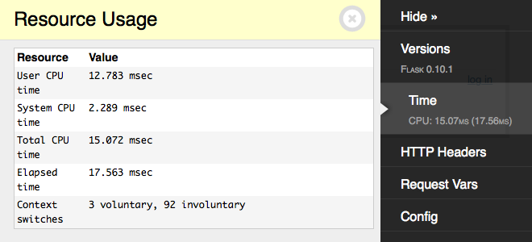
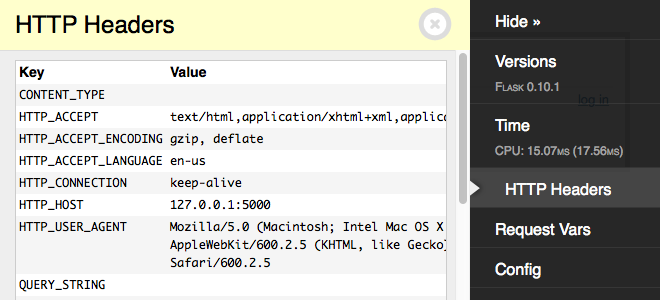
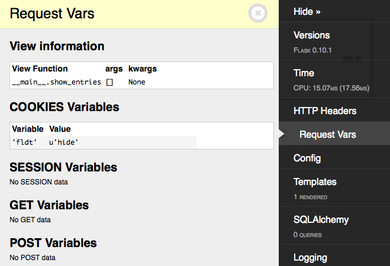
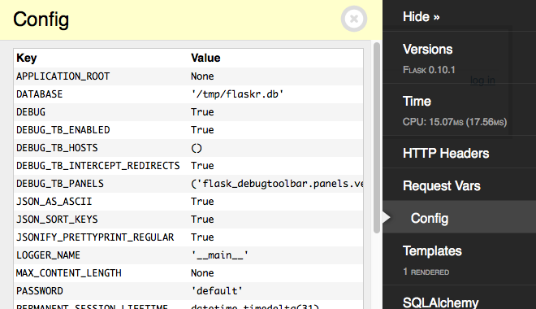
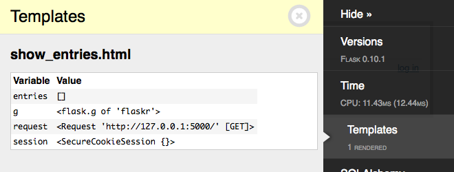
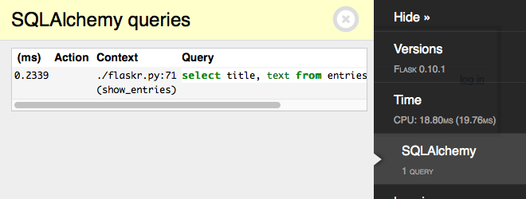
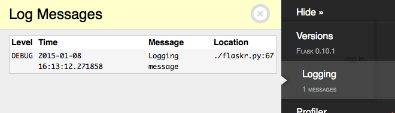
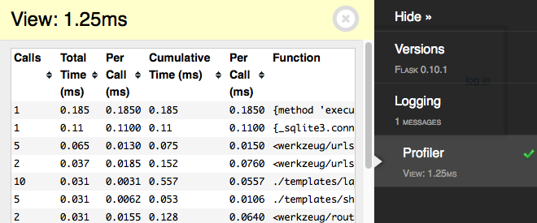

Built-In Panels
===============

Versions
--------
    flask_debugtoolbar.panels.versions.VersionDebugPanel

Shows the installed Flask version. The expanded view displays all installed packages and their versions as detected by ``setuptools``.

Time
----

    flask_debugtoolbar.panels.timer.TimerDebugPanel

Shows the time taken to process the current request. The expanded view includes the breakdown of CPU time, by user and system, wall clock time, and context switches.

HTTP Headers
------------

    flask_debugtoolbar.panels.headers.HeaderDebugPanel

Displays the HTTP headers for the current request.

Request Vars
------------

    flask_debugtoolbar.panels.request_vars.RequestVarsDebugPanel

Displays details of the Flask request-related variables, including the view function parameters, cookies, session variables, and GET and POST variables.

Config
------

    flask_debugtoolbar.panels.config_vars.ConfigVarsDebugPanel

Shows the contents of the Flask application's config dict ``app.config``.

Templates
---------

    flask_debugtoolbar.panels.template.TemplateDebugPanel

Shows information about the templates rendered for this request, and the value of the template parameters provided.

SQLAlchemy
----------

    flask_debugtoolbar.panels.sqlalchemy.SQLAlchemyDebugPanel

Shows SQL queries run during the current request.

.. note:: This panel requires using the `Flask-SQLAlchemy`_ extension in order
   to record the queries. See the Flask-SQLAlchemy
   :ref:`flasksqlalchemy:quickstart` section to configure it.

   For additional details on query recording see the
   :py:func:`~flask_sqlalchemy.get_debug_queries` documentation.

.. note:: SQL syntax highlighting requires `Pygments`_ to be installed.

.. _Flask-SQLAlchemy: https://flask-sqlalchemy.palletsprojects.com/

.. _Pygments: https://pygments.org/

Logging
-------

    flask_debugtoolbar.panels.logger.LoggingPanel

Displays log messages recorded during the current request.

Route List
----------

    flask_debugtoolbar.panels.route_list.RouteListDebugPanel

Displays the Flask URL routing rules.

Profiler
--------

    flask_debugtoolbar.panels.profiler.ProfilerDebugPanel

Reports profiling data for the current request. Due to the performance overhead, profiling is disabled by default. Click the checkmark to toggle profiling on or off. After enabling the profiler, refresh the page to re-run it with profiling.

Flamegraph
----------

    flask_debugtoolbar.panels.flamegraph.FlamegraphDebugPanel

Shows a sampled flamegraph of the Python call stacks observed while the current
view function runs. Wider frames account for more of the view's elapsed time;
frames above another frame are functions called by it. Click a frame to zoom,
or use the search field to highlight matching functions and modules. The graph
can be exported as a standalone SVG, and the underlying samples can be exported
in folded-stack format for use with other FlameGraph-compatible tools.

Sampling is disabled by default to avoid adding overhead to every request.
Click the checkmark to enable it and then refresh the page, or set
``DEBUG_TB_FLAMEGRAPH_ENABLED`` to ``True``. The sample interval is controlled
by ``DEBUG_TB_FLAMEGRAPH_INTERVAL`` and defaults to one millisecond.

The panel uses only Python's standard library. It works in threaded servers and
does not require the Unix signals or Perl renderer used by the original
``flask-debugtoolbar-flamegraph`` extension.
